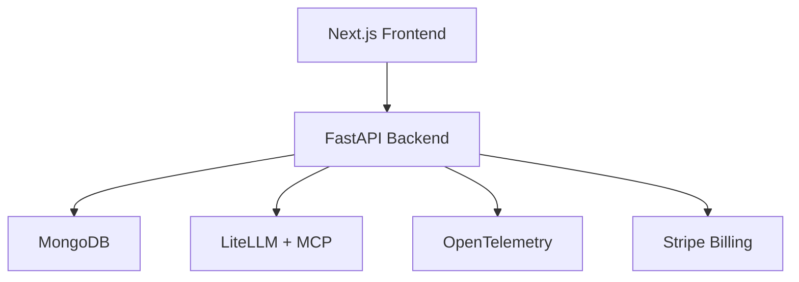

# How I Built a Reusable AI Monetization Platform with Stripe

*Posted on November 15, 2025*

In the AI era, pricing isn't just a webpage—it's infrastructure. As Scott Woody declared in his "AI Has Changed SaaS Forever" talk, flexible, usage-based models that evolve with your product are critical to stay competitive. I faced this challenge while building [DocRouter.AI](https://docrouter.ai) (document processing), [SigAgent.AI](https://sigagent.ai) (agent monitoring), and planning a consulting AI portal for a lab platform. The solution? A single Stripe-powered monetization platform, reusable across all three, cutting implementation from months to days.

This post shares that pattern: how one base stack (Next.js, FastAPI, Stripe) became a portable monetization engine, infused with pricing lessons from the "SaaS Pricing in the Value Era" and FinTech API research. Whether you're launching an AI startup or consulting for enterprises, here's how to master monetization in the AI-driven "Cambrian explosion."

---

## The Reusable Platform: One Stack, Many Products

DocRouter.AI, SigAgent.AI, and our consulting portal concept share a modular platform designed for flexibility and monetization:

- **Frontend**: Next.js with NextAuth for user management.
- **Backend**: FastAPI for async, scalable APIs.
- **Database**: MongoDB for usage tracking and customer data.
- **AI Layer**: LiteLLM for LLM routing; MCP for Claude agent control.
- **Observability**: OpenTelemetry for traces (key for SigAgent.AI).
- **Billing**: Stripe for subscriptions, credit packs, and invoices.

*Diagram: Platform Architecture*



**Key Insight**: Billing is a core component, not an afterthought. By treating monetization as infrastructure, we enabled reuse across products, aligning with McKinsey's call for scalable systems in the AI era.

---

## Product 1: DocRouter.AI's Stripe Integration

DocRouter.AI is a document AI layer using LLMs for extraction and validation. Its pricing reflects AI's variable value:

- **Value Metric**: Service Processing Units (SPUs), mapping to pages and tokens.
- **Hybrid Model**:
  - Free tier: 100 SPUs, no credit card.
  - Individual/Team plans: Monthly subscriptions with SPU allowances.
  - A-la-carte SPU packs for usage spikes.
  - Enterprise: Outcome-based contracts, tied to SPUs internally.

**Stripe Implementation**:

- Handles payments, taxes, and invoices.
- We track usage in MongoDB, not Stripe meters, for flexibility.
- Code syncs Stripe state (subscriptions, credits) to Mongo via webhooks.

**Pricing Lesson (Value Era)**: Static plans fail in AI's variable world. Hybrid models—plans plus credits—capture value across startups and enterprises, like Stripe's own API pricing (FinTech PDF).

**Outcome**: Implementing Stripe took three months due to API complexities and unreliable code examples. But it became the foundation for future products.

---

## Product 2: SigAgent.AI's Three-Week Clone

To test reusability, I cloned DocRouter.AI's codebase for SigAgent.AI, an AI agent monitoring tool using OpenTelemetry traces. In three weeks, it was live:

- **Same Stack**: Next.js, FastAPI, MongoDB, Stripe.
- **New Logic**: Trace analysis instead of document workflows.
- **Same Monetization**:
  - New Stripe product (`product=sig_agent` metadata).
  - Identical hybrid model: free tier, plans, credit packs.
  - Same code for syncing Stripe and applying credits.

**Pricing Lesson (Woody)**: Treat pricing as infrastructure. By configuring tiers via Stripe metadata, not hard-coded IDs, we launched SigAgent.AI without rewriting billing.

**Outcome**: Stripe integration took days, not months, proving the platform's portability.

---

## Consulting Vision: An AI Portal Ready for Monetization

For a Starlims-like lab platform, we're planning an AI portal to monitor a coding copilot and chat agent. We've stood up the platform to trace Claude agent steps, leveraging OpenTelemetry for observability. It's not fully built, but the foundation is ready:

- **Deployed Stack**: Rebranded UI, reused telemetry, extensible for lab workflows.
- **Monetization Potential**: Stripe is wired, awaiting pricing decisions. Options include:
  - Credits per trace or copilot session.
  - Team plans for internal users.
  - Outcome-based fees (e.g., "per lab report approved").

With a product manager (10h/week) and AI architect (20h/week) over three months, we're poised to deliver a monetization-ready portal. **Lesson (Woody)**: In AI's fast-moving world, a pre-wired billing component lets you adapt to customer needs on demand.

---

## Pricing Principles for the AI Era

Our platform embodies three pricing lessons from the literature:

### 1. Hybrid Archetype: Plans + Credits

Static plans can't handle AI's variance (e.g., 50 vs. 5,000 emails processed). Our hybrid model—free tier, plans with credits, a-la-carte packs—scales with usage. **Example**: Plaid's freemium-to-enterprise API model (FinTech PDF).

### 2. Reusable Value Metric

Define a "credit" (e.g., SPUs) tied to work units. This lets you layer multiple business models on one meter. **Lesson**: A flexible metric simplifies product launches.

### 3. Customer Trust: Predictable, Visible, Controllable

> "Monetization must be predictable, visible, controllable." — Scott Woody

We built:

- Usage dashboards (SPUs used, projected costs).
- Alerts at 70/90/100% of allowance.
- Caps to prevent bill shock.

This builds trust, encouraging adoption of usage-based models.

---

## Technical Implementation: The Monetization Engine

Here's how we built a flexible billing system:

### Stripe as Configuration

- **Variables**: `STRIPE_SECRET_KEY`, `STRIPE_WEBHOOK_SECRET`, `STRIPE_PRODUCT_TAG` (e.g., `doc_router`).
- **Metadata-Driven**: Products/prices use metadata (`product=sig_agent`, `tier=team`) to auto-discover tiers.
- **Hosted Flows**: Stripe Checkout for subscriptions/packs; Billing Portal for self-service.

### Usage Metering

- Log usage in Mongo (e.g., `org_id`, `spus_delta`).
- Periodic job aggregates usage, applies credits, and adds overages to Stripe invoices.
- **Why Not Stripe Meters?** Custom logic ensures future flexibility.

### Customer UX

- Dashboards show real-time usage and projections.
- Alerts and caps align with Woody's "controllable" principle.

**Code Snippet (Webhook Sync)**:

```javascript
app.post('/webhook', async (req, res) => {
  const event = stripe.webhooks.constructEvent(req.body, req.headers['stripe-signature'], process.env.STRIPE_WEBHOOK_SECRET);
  if (event.type === 'checkout.session.completed') {
    const session = event.data.object;
    await db.collection('orgs').updateOne(
      { stripe_customer_id: session.customer },
      { $set: { subscription_status: 'active', credits: session.metadata.credits || 0 } }
    );
  }
  res.sendStatus(200);
});
```

---

## Your AI Monetization Checklist

To replicate this pattern:

1. **Define a Value Metric**  
   - *Example*: Stripe's per-transaction fees.  

2. **Pick a Hybrid Archetype**  
   - *Example*: Plaid's free tier + enterprise licenses.  

3. **Use Stripe as Config**  
   - *Example*: Metadata-driven tiers like `included_spus`.  

4. **Separate Metering from Billing**  
   - *Example*: Mongo logs for SPU tracking.  

5. **Ensure Visibility and Control**  
   - *Example*: SigAgent's trace alerts.  

6. **Build for Reuse**  
   - *Example*: Our 90% shared code.

Ready to build your AI monetization platform? Explore our [Stripe integration tutorial](https://analytiqhub.com/tech/programming/ai/tutorials/how-we-integrated-stripe-into-docrouter-ai/) or [contact Analytiq Hub](https://analytiqhub.com/contact) for consulting.

---

## Sources and Related Reading

- "SaaS Pricing in the Value Era: Why Flexible Infrastructure Matters"
- Scott Woody, "AI Has Changed SaaS Forever" (Monetize 2025)
- "API Monetization in FinTech Startups" (IJSRA, 2024)
- [How to Train Your AI Agent](https://analytiqhub.com/link-to-agent-post)
